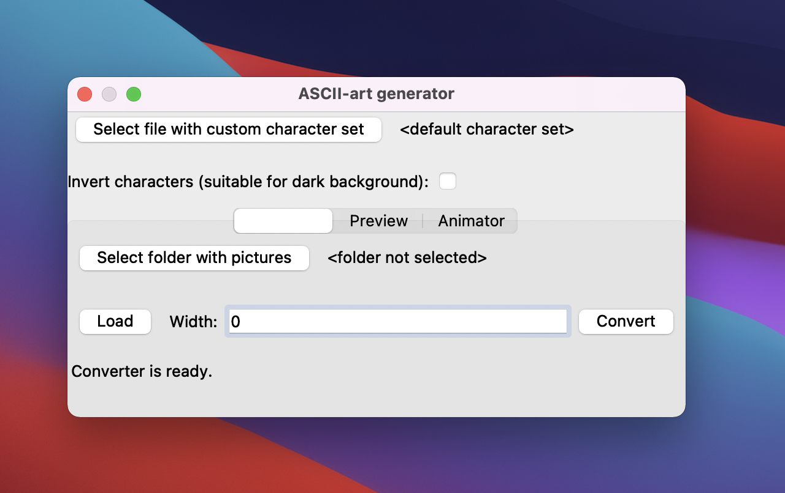
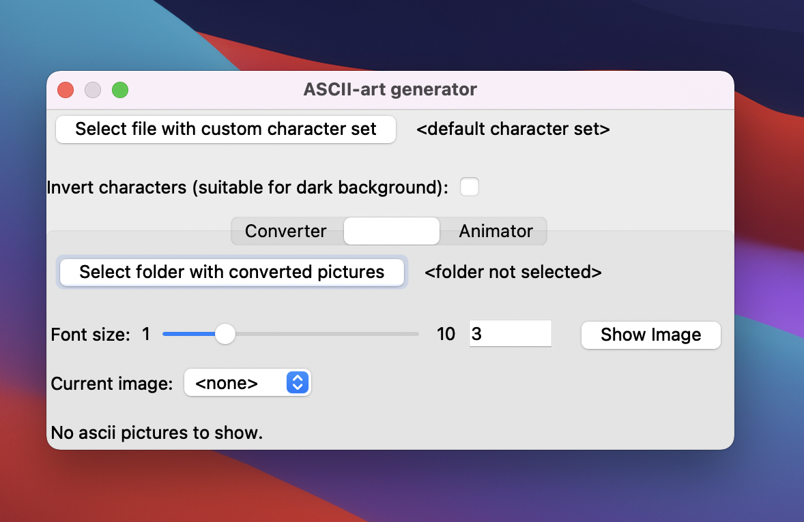
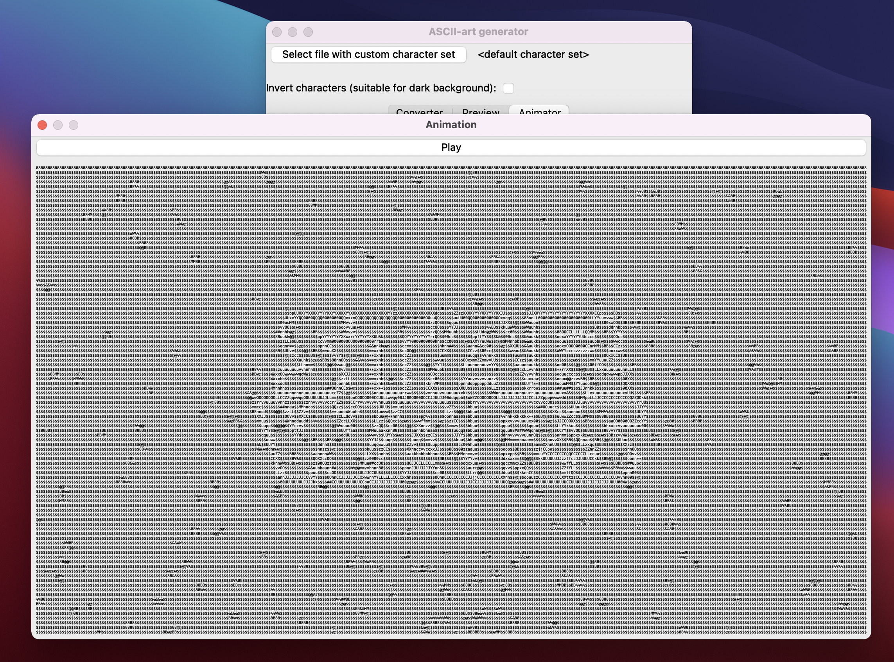

# GUI pro aplikaci ASCII-art generator

Semestrální práce z předmětu BI-PYT. Tomáš Batěk, 2020.

## Shrnutí

Cílem semestrální práce bylo vytvořit grafické uživatelské rozhraní pro CLI aplikaci
[ASCII-art generator](https://github.com/tomas-bat/ASCII-art-generator). Tato aplikace byla vytvořena jako
semestrální práce v předmětu BI-PA2 v LS 2019/20. Jedná se o program napsaný v C/C++, který umí konvertovat obrázky
typu JPEG/PNG do ASCII podoby.

V této semestrální práci se tedy jedná o nadstavbu zmíněné CLI aplikace, která ji bude umět ovládat pomocí GUI.

## Jak spustit aplikaci

Před instalací tohoto programu je potřeba mít nainstalovaný Python 3.

1. Stáhnout tento projekt: `git clone https://github.com/tomas-bat/BI-PYT-Semestralni-prace`

2. Nainstalovat potřebné moduly: `pip install -r requirements.txt`

3. Získat spustitelný soubor původní CLI aplikace pomocí připraveného skriptu: `./get_generator.sh`

4. Spustit aplikaci: `python main.py`

Pokud se při nějakém kroku instalace vyskytl problém, vizte prosím sekci 'Problémy při instalaci'

## Jak používat aplikaci

Po spuštění aplikace se objeví následující okno:

Kliknutím na `Select file with custom character set` se zobrazí možnost vybrat libovolný soubor, který bude
použit jako paleta pro ASCII znaky. Načítání funguje tak, že načte první řádek vybraného souboru a tento řádek
bude považovat za ASCII přechod, který bude použit při konverzi. Pokud nevyberete žádný vlastní ASCII přechod,
bude použit výchozí.

Zaškrtnutím políčka `Invert characters` nastavíte inverzi pro konverzi, tedy to, že ASCII přechod bude načítán
obráceně. Je vhodné inverzi vypnout, pokud zobrazujete ASCII obrázek na světlém pozadí, a naopak zapnout, pokud
obrázek zobrazujete na tmavém pozadí.

Pod těmito možnostmi je výběr tří tabů - Converter, Preview, Animator.

### Converter

Ve výchozím stavu je vybrán tab `Converter`. Abyste mohli konvertovat obrázky, je potřeba vybrat složku, odkud
se obrázky budou načítat. Tak učiníte kliknutím na `Select folder with pictures`, což otevře dialog, pomocí
kterého budete moct vybrat složku. Jakmile vyberete složku, odkud se obrázky mají načítat, můžete specifikovat
maximální šířku, jakou mají výsledné obrázky mít. Pokud ponecháte nastavení šířky na 0, obrázky budou mít svojí původní
šířku. Kliknutím na tlačítko `Load` aplikace vypíše, jaké obrázky se podařilo ze složky načíst a tlačítko `Convert`
všechny tyto obrázky konvertuje do ASCII podoby do podsložky 'converted'. Pokud chcete náhled, jak výsledné obrázky
vypadají, použijte tab Preview pro zobrazení konkrétního obrázku, nebo tab Animator pro zobrazení animace z více
obrázků.

### Preview

V tabu Preview musíte opět vybrat složku, tentokrát ale složku s konvertovanými obrázky. Pokud ste již obrázky
konvertovali, bude se tato složka nacházet ve složce, kterou ste zadali v tabu Converter. Pokud máte vybráno,
tak si můžete zvolit, jakou velikost písma budou mít znaky zobrazovaného ASCII obrázku pomocí `Font size`. Pod tím
si můžete zvolit, který konkrétní obrázek z této složky chcete zobrazit. Kliknutím na tlačítko `Show image` 
se otevře nové okno s ASCII obrázkem.

### Animator

Tab Animator funguje velmi podobně jako Preview. Rozdíl je ten, že nevybíráte jeden obrázek, který se zobrazí na novém
okně, ale místo toho se načtou všechny obrázky z vybrané složky a animace z těchto obrázků se zobrazí na novém okně.
Navíc máte taky možnost nastavit, počet snímků za sekundu pro animaci pomocí `FPS` posuvníku.

## Ukázka aplikace

## Problémy při instalaci

- Tento program byl vyvíjen pomocí Pythonu 3.8, doporučuji tedy používat tuto verzi Pythonu.
  
- Projekt na Githubu je plánovaný jako veřejný, v tuto chvíli však zatím není.

### Instalace potřebných modulů

Příkaz `pip` by měl být schopen nainstalovat potřebné moduly pro běh této aplikace. Narazil jsem však
na situaci, kdy aplikace odmítala fungovat kvůli problémům s moduly. Tento problém lze vyřešit tak, že
potřebné moduly nainstalujete pomocí příkazu `conda install`, místo `pip install`. K tomu je však
potřeba nainstalovat alespoň [minicondu](https://docs.conda.io/en/latest/miniconda.html).

### Získání spustitelného souboru původní CLI aplikace.

Původní CLI aplikace [ASCII-art generator](https://github.com/tomas-bat/ASCII-art-generator) je vlastní
projekt. Pro funkci této Python aplikace je však potřeba získat spustitelný soubor původní CLI
aplikace, který je výsledkem kompilace projektu.

Pro získání spustitelného souboru původní CLI aplikace je připraven skript, který postupně udělá následující:

1. Stáhne z Githubu projekt původní CLI aplikace do složky '.generator'.

2. Zkompiluje aplikaci pomocí příkazu `make compile`.

3. Přesune spustitelný soubor 'generator' do složky Python projektu a smaže všechny soubory projektu
původní CLI aplikace.
   
Kompilace původní CLI aplikace je navržena pro macOS a Linux. Potřebuje externí knihovny 'libpng' a 'libjpeg'.

Pokud se pokusíte aplikaci spustit bez přítomnosti spustitelného souboru původní CLI aplikace, vyskytne se pouze
chybová hláška a program se ukončí.

